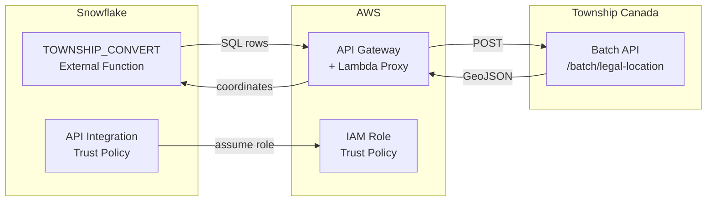

# Township Canada — Snowflake Native App

Snowflake Native App that helps customers set up the `TOWNSHIP_CONVERT` external function for converting Canadian legal land descriptions (DLS/NTS) to GPS coordinates via the Township Canada Batch API.

## What This App Does

This app is a **setup wizard and reference bundle**. It does not call the API directly — instead it guides the user through creating the required AWS infrastructure and Snowflake objects.

The app provides:

- An interactive **Streamlit setup wizard** for step-by-step configuration
- **SQL generators** that produce the ACCOUNTADMIN scripts needed to create the API Integration and External Function
- **Lambda code** for the AWS proxy function
- **IAM policy generators** for AWS role configuration
- A **VALIDATE_LLD** function for checking legal land description formats locally
- **Reference views** with sample queries, supported formats, and pricing

## Architecture



## Deploy to Snowflake

### 1. Create the Application Package and Stage

```sql
CREATE APPLICATION PACKAGE IF NOT EXISTS township_canada_pkg
  COMMENT = 'Township Canada — Legal Land Description to GPS Conversion';

USE APPLICATION PACKAGE township_canada_pkg;
CREATE SCHEMA IF NOT EXISTS stage_content;
CREATE OR REPLACE STAGE township_canada_pkg.stage_content.app_stage
  DIRECTORY = (ENABLE = TRUE);
```

### 2. Upload files to the stage

Upload using SnowSQL, snowflake-cli, or the Snowsight UI:

```sql
PUT file://manifest.yml @township_canada_pkg.stage_content.app_stage/ AUTO_COMPRESS=FALSE OVERWRITE=TRUE;
PUT file://setup_script.sql @township_canada_pkg.stage_content.app_stage/ AUTO_COMPRESS=FALSE OVERWRITE=TRUE;
PUT file://streamlit/setup_wizard.py @township_canada_pkg.stage_content.app_stage/streamlit/ AUTO_COMPRESS=FALSE OVERWRITE=TRUE;
```

Or use the Python upload script:

```bash
python3 scripts/upload.py
```

### 3. Register a version

Release channels are enabled by default on new application packages. Use `REGISTER` instead of `ADD`:

```sql
ALTER APPLICATION PACKAGE township_canada_pkg
  REGISTER VERSION v1_0
  USING '@township_canada_pkg.stage_content.app_stage';

ALTER APPLICATION PACKAGE township_canada_pkg
  MODIFY RELEASE CHANNEL DEFAULT
  ADD VERSION v1_0;

ALTER APPLICATION PACKAGE township_canada_pkg
  MODIFY RELEASE CHANNEL DEFAULT
  SET DEFAULT RELEASE DIRECTIVE
  VERSION = v1_0
  PATCH = 0;
```

### 4. Create an application for testing

```sql
CREATE APPLICATION IF NOT EXISTS township_canada_app
  FROM APPLICATION PACKAGE township_canada_pkg;

-- Verify
SELECT township_canada_app.core.version();
SELECT township_canada_app.core.validate_lld('NW-36-42-3-W5');
```

### 5. Open the Streamlit wizard

Navigate to the application in Snowsight. The setup wizard opens automatically.

## Publish to Snowflake Marketplace

### 1. Set distribution to EXTERNAL

This triggers an automated security scan:

```sql
ALTER APPLICATION PACKAGE township_canada_pkg
  SET DISTRIBUTION = 'EXTERNAL';

-- Check scan status (review_status → APPROVED before proceeding)
SHOW VERSIONS IN APPLICATION PACKAGE township_canada_pkg;
```

### 2. Add a README to the stage

Snowflake requires a `readme.md` for Marketplace listings. Upload it to the stage alongside your other files.

### 3. Create a Provider Profile

- Go to **Marketplace > Provider Studio** in the left sidebar
- Set up your provider profile (company name, logo, contact info)

### 4. Create the Listing

- In Provider Studio, click **Create Listing > Snowflake Marketplace**
- Product type: **Native App**
- Attach `TOWNSHIP_CANADA_PKG` as the data product
- Choose access type: Free, Limited trial, or Paid
- Fill in: description, subtitle, category, sample queries, business needs

### 5. Submit for Approval

- Click **Submit for Approval** in the listing
- Snowflake performs a functional review checking:
  - App works after install (immediate utility)
  - Not a shell/pass-through app (standalone)
  - Privileges and references declared in manifest (transparency)
- You'll get an email when approved or denied

### 6. Publish

Once approved, click **Publish**.

### Things to Watch For

- Your app requires an external API integration (the `township_api_integration` reference) — make sure the setup wizard clearly walks consumers through configuring it, since the app won't be "immediately functional" without it
- Consider adding a trial with limited free queries so consumers can test before committing

## Full Guide

See the complete integration guide at:
https://townshipcanada.com/guides/snowflake-external-function
