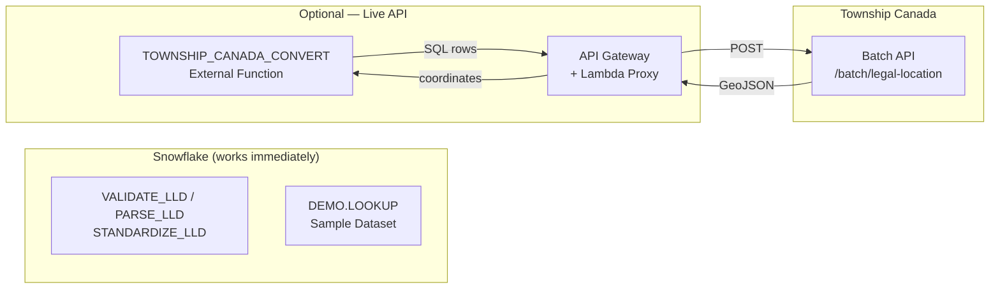

# Township Canada — Snowflake Native App

Snowflake Native App for working with Canadian legal land descriptions (DLS/NTS). Provides built-in validation, parsing, standardization, and sample GPS coordinate lookups — plus an optional external API integration for live batch conversions.

## What You Get Immediately

After installing the app, these features work right away — no external setup or API key required:

- **`CORE.VALIDATE_LLD(lld)`** — Check if a string matches a recognized DLS legal land description format
- **`CORE.PARSE_LLD(lld)`** — Parse a land description into structured components (quarter, section, township, range, meridian)
- **`CORE.STANDARDIZE_LLD(lld)`** — Normalize any supported format to standard dash-separated format (e.g., `NW-36-42-3-W5`)
- **`DEMO.LOOKUP(lld)`** — Look up GPS coordinates from 100 pre-computed sample conversions
- **`DEMO.SAMPLE_CONVERSIONS`** — Browse the full sample dataset of Alberta and Saskatchewan land descriptions with coordinates
- **Reference views** — Supported formats, sample queries, and setup guides

### Sample Queries (Work Immediately)

```sql
-- Validate a legal land description
SELECT CORE.VALIDATE_LLD('NW-36-42-3-W5');
-- Returns: TRUE

-- Parse into components
SELECT CORE.PARSE_LLD('NW-36-42-3-W5');
-- Returns: {"quarter":"NW","section":36,"township":42,"range":3,"meridian":"W5","standardized":"NW-36-42-3-W5"}

-- Standardize different formats
SELECT CORE.STANDARDIZE_LLD('NE 7 102 19 W4');
-- Returns: NE-7-102-19-W4

-- Look up coordinates from sample dataset
SELECT DEMO.LOOKUP('NW-36-42-3-W5');
-- Returns: {"latitude":52.3206,"longitude":-114.3356,"province":"AB","description":"Near Eckville, Alberta","source":"demo_dataset"}

-- Browse all sample data
SELECT * FROM DEMO.SAMPLE_CONVERSIONS;

-- Validate your own data
SELECT lld_column,
       CORE.VALIDATE_LLD(lld_column) AS is_valid,
       CORE.STANDARDIZE_LLD(lld_column) AS standardized,
       CORE.PARSE_LLD(lld_column) AS parsed
FROM your_table;
```

## Optional: Live API Conversion

For live batch conversions of any legal land description (not just the sample dataset), you can configure the `TOWNSHIP_CANADA_CONVERT` external function. This connects to the Township Canada API through AWS.

### Prerequisites for Live API

- **AWS account** with permissions to create API Gateway endpoints, Lambda functions, and IAM roles
- **Township Canada API key** — for technical details see [townshipcanada.com/api](https://townshipcanada.com/api)

### Architecture



### Step 1: Deploy Lambda Function

Create an AWS Lambda function (Python 3.12, 30-second timeout) with the `TOWNSHIP_API_KEY` environment variable set to your API key. Get the Lambda code from the app:

```sql
CALL CONFIG.GET_LAMBDA_CODE();
```

### Step 2: Create API Gateway

1. Create a **REST API** in API Gateway
2. Add a **POST** method at the root resource (`/`)
3. Set integration type to **Lambda Function**
4. Enable **IAM authorization**
5. Deploy to a stage (e.g., `prod`)

### Step 3: Create IAM Role

Create an IAM role with API Gateway execution policy. Generate the policy from the app:

```sql
CALL CONFIG.GET_IAM_POLICY('<aws_account_id>', '<api_id>');
```

### Step 4: Generate Snowflake Setup SQL

Run this in the app to generate the ACCOUNTADMIN script:

```sql
CALL CONFIG.CONFIGURE(
  'https://<api-id>.execute-api.<region>.amazonaws.com/prod',
  'arn:aws:iam::<account>:role/<role-name>'
);
```

An ACCOUNTADMIN must run the generated script to create the API Integration and External Function.

### Step 5: Configure Trust Policy

After running `DESCRIBE INTEGRATION township_canada_integration`, generate the trust policy:

```sql
CALL CONFIG.GENERATE_TRUST_POLICY('<API_AWS_IAM_USER_ARN>', '<API_AWS_EXTERNAL_ID>');
```

Update the IAM role trust policy in the AWS Console with the generated JSON.

### Step 6: Test

```sql
SELECT TOWNSHIP_CANADA_CONVERT('NW-36-42-3-W5') AS result;
CALL CORE.HEALTH_CHECK();
```

## Deploy to Snowflake

### 1. Create the Application Package and Stage

```sql
CREATE APPLICATION PACKAGE IF NOT EXISTS township_canada_pkg
  COMMENT = 'Township Canada — Legal Land Description to GPS Conversion';

USE APPLICATION PACKAGE township_canada_pkg;
CREATE SCHEMA IF NOT EXISTS stage_content;
CREATE OR REPLACE STAGE township_canada_pkg.stage_content.app_stage
  DIRECTORY = (ENABLE = TRUE);
```

### 2. Upload files to the stage

Upload using SnowSQL, snowflake-cli, or the Snowsight UI:

```sql
PUT file://manifest.yml @township_canada_pkg.stage_content.app_stage/ AUTO_COMPRESS=FALSE OVERWRITE=TRUE;
PUT file://setup_script.sql @township_canada_pkg.stage_content.app_stage/ AUTO_COMPRESS=FALSE OVERWRITE=TRUE;
PUT file://streamlit/setup_wizard.py @township_canada_pkg.stage_content.app_stage/streamlit/ AUTO_COMPRESS=FALSE OVERWRITE=TRUE;
```

Or use the Python upload script:

```bash
python3 scripts/upload.py
```

### 3. Register a version

```sql
ALTER APPLICATION PACKAGE township_canada_pkg
  REGISTER VERSION v1_0
  USING '@township_canada_pkg.stage_content.app_stage';

ALTER APPLICATION PACKAGE township_canada_pkg
  MODIFY RELEASE CHANNEL DEFAULT
  ADD VERSION v1_0;

ALTER APPLICATION PACKAGE township_canada_pkg
  MODIFY RELEASE CHANNEL DEFAULT
  SET DEFAULT RELEASE DIRECTIVE
  VERSION = v1_0
  PATCH = 0;
```

### 4. Create an application for testing

```sql
CREATE APPLICATION IF NOT EXISTS township_canada_app
  FROM APPLICATION PACKAGE township_canada_pkg;

-- Verify immediate functionality
SELECT township_canada_app.core.version();
SELECT township_canada_app.core.validate_lld('NW-36-42-3-W5');
SELECT township_canada_app.core.parse_lld('NW-36-42-3-W5');
SELECT township_canada_app.core.standardize_lld('NE 7 102 19 W4');
SELECT township_canada_app.demo.lookup('NW-36-42-3-W5');
SELECT * FROM township_canada_app.demo.sample_conversions;
```

### 5. Open the Streamlit wizard

Navigate to the application in Snowsight. The setup wizard opens automatically with the **Try Now** tab for immediate exploration.

## Full Guide

See the complete integration guide at:
https://townshipcanada.com/guides/snowflake-external-function
